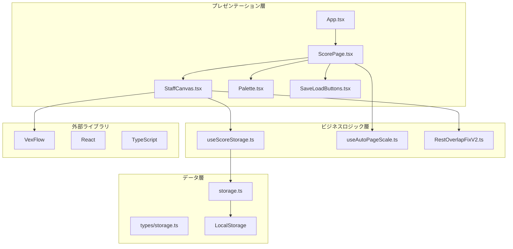
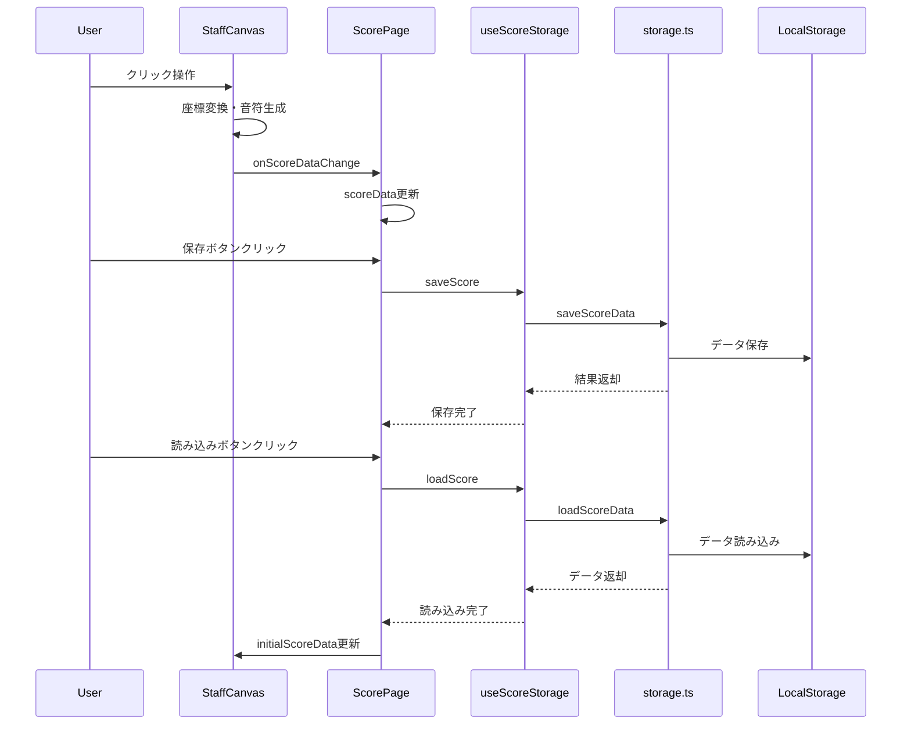

# 設計書

## 概要

Music Editor MVPは、モダンなWebテクノロジーを活用した楽譜作成アプリケーションです。React + TypeScript + VexFlowを基盤とし、直感的なユーザーインターフェースと高精度な楽譜レンダリングを提供します。本システムは、コンポーネントベースのアーキテクチャを採用し、保守性と拡張性を重視した設計となっています。

## アーキテクチャ

### システム全体構成



### レイヤー構成

1. **プレゼンテーション層**: ユーザーインターフェースとユーザーインタラクション
2. **ビジネスロジック層**: アプリケーション固有のロジックとデータ変換
3. **データ層**: データの永続化と型定義
4. **外部ライブラリ層**: サードパーティライブラリとの統合

## コンポーネントとインターフェース

### 主要コンポーネント

#### 1. ScorePage コンポーネント
- **責務**: アプリケーションのメインコンテナ、レイアウト管理
- **状態管理**: 楽譜メタデータ、選択ツール、スケール設定
- **子コンポーネント**: StaffCanvas, Palette, SaveLoadButtons

```typescript
interface ScorePageProps {
  // プロパティなし（ルートコンポーネント）
}

interface ScorePageState {
  tool: Tool;
  title: string;
  subtitle: string;
  lyricist: string;
  composer: string;
  arranger: string;
  scoreData: MeasureData[] | undefined;
}
```

#### 2. StaffCanvas コンポーネント
- **責務**: 五線譜の描画、音符配置、ユーザーインタラクション処理
- **VexFlow統合**: 楽譜レンダリングエンジンとの連携
- **座標変換**: クライアント座標とSVG座標の正確な変換

```typescript
interface StaffCanvasProps {
  systems?: number;
  gap?: number;
  measuresPerSystem?: number;
  tool: Tool;
  scale?: number;
  initialScoreData?: MeasureData[];
  onScoreDataChange?: (data: MeasureData[]) => void;
  startMeasureIndex?: number;
}
```

#### 3. Palette コンポーネント
- **責務**: 音価と休符の選択インターフェース
- **VexFlow統合**: 音符・休符アイコンの動的生成

```typescript
interface PaletteProps {
  value: Tool;
  onChange: (tool: Tool) => void;
}

interface Tool {
  duration: DurKey;
  isRest?: boolean;
}
```

#### 4. SaveLoadButtons コンポーネント
- **責務**: 保存・読み込み操作のユーザーインターフェース
- **状態表示**: 保存中・読み込み中の視覚的フィードバック

```typescript
interface SaveLoadButtonsProps {
  onSave: () => Promise<void>;
  onLoad: () => Promise<void>;
  isSaving: boolean;
  isLoading: boolean;
  hasStoredData: boolean;
  error: string | null;
}
```

### カスタムフック

#### 1. useScoreStorage
- **責務**: 楽譜データの保存・読み込み処理
- **エラーハンドリング**: 容量不足、データ破損等の適切な処理

```typescript
interface UseScoreStorageReturn {
  saveScore: (metadata: ScoreMetadata, measures: MeasureData[], systems: number, measuresPerSystem: number) => Promise<boolean>;
  loadScore: () => Promise<SavedScoreData | null>;
  hasStoredData: () => boolean;
  clearStoredData: () => Promise<boolean>;
  error: string | null;
  isLoading: boolean;
  isSaving: boolean;
}
```

#### 2. useAutoPageScale
- **責務**: 画面サイズに応じた自動スケーリング
- **レスポンシブ対応**: 動的なスケール値計算

```typescript
interface UseAutoPageScaleReturn {
  spreadRef: RefObject<HTMLDivElement>;
  scale: number;
}
```

## データモデル

### 楽譜データ構造

```typescript
// 音符・休符の基本単位
interface NoteEvent {
  dur: DurKey;           // 音価 ('1'|'2'|'4'|'8'|'16'|'32'|'64')
  isRest: boolean;       // 休符フラグ
  key: string;           // 音高 (例: 'c/4', 'f#/5')
}

// 小節データ
interface MeasureData {
  events: NoteEvent[];   // 小節内の音符・休符リスト
}

// 楽譜メタデータ
interface ScoreMetadata {
  title: string;         // タイトル
  subtitle: string;      // サブタイトル
  lyricist: string;      // 作詞者
  composer: string;      // 作曲者
  arranger: string;      // 編曲者
}

// 保存データ形式
interface SavedScoreData {
  version: string;                // データバージョン
  timestamp: number;              // 保存時刻
  metadata: ScoreMetadata;        // メタデータ
  measures: MeasureData[];        // 小節データ配列
  systems: number;                // 段数
  measuresPerSystem: number;      // 1段あたりの小節数
}
```

### データフロー



## エラーハンドリング

### エラー分類と対応

#### 1. ストレージエラー
- **QUOTA_EXCEEDED**: 容量不足時の代替手段提案
- **STORAGE_DISABLED**: プライベートブラウジング対応
- **CORRUPTED_DATA**: データ復旧とバックアップ利用

#### 2. 座標変換エラー
- **変換行列取得失敗**: フォールバック座標の使用
- **無効座標値**: 安全な座標値への置換
- **SVG要素未取得**: エラーログ出力と処理継続

#### 3. VexFlowエラー
- **描画失敗**: Unicodeフォールバック表示
- **音符生成失敗**: デフォルト音符での代替
- **フォーマッタエラー**: 個別描画への切り替え

### エラーハンドリング戦略

```typescript
// 例: 座標変換のエラーハンドリング
function clientToGroup(svg: SVGSVGElement, group: SVGGElement, clientX: number, clientY: number): { x: number; y: number } {
  const pt = svg.createSVGPoint();
  pt.x = clientX; 
  pt.y = clientY;
  
  const m = (group as any).getScreenCTM?.();
  
  if (!m) {
    console.warn('getScreenCTM returned null, using fallback coordinates');
    return { x: 0, y: 0 };
  }
  
  try {
    const p = pt.matrixTransform(m.inverse());
    
    if (!isFinite(p.x) || !isFinite(p.y)) {
      console.warn('Invalid coordinates after transformation:', { x: p.x, y: p.y });
      return { x: 0, y: 0 };
    }
    
    return { x: p.x, y: p.y };
  } catch (error) {
    console.error('Error during coordinate transformation:', error);
    return { x: 0, y: 0 };
  }
}
```

## 正確性プロパティ

*プロパティとは、システムの全ての有効な実行において真であるべき特性や動作です。これらは人間が読める仕様と機械で検証可能な正確性保証の橋渡しとなります。*

### プロパティ 1: レイアウト自動調整の一貫性
*任意の* 楽譜データと画面サイズに対して、システムは適切な段間隔とページ分割を維持し、各ページに正しいページ番号を表示する
**検証対象: 要件 1.2, 1.3**

### プロパティ 2: 音符配置の位置精度
*任意の* クリック座標と選択ツールに対して、システムはクリック位置から正確な音高を計算し、0.5行刻みでスナップした位置に音符または休符を配置する
**検証対象: 要件 2.1, 2.2, 2.3**

### プロパティ 3: 小節拍数制限の遵守
*任意の* 音価組み合わせに対して、小節内の合計拍数が4拍を超える場合、システムは音符追加を拒否し、小節状態を変更しない
**検証対象: 要件 2.4**

### プロパティ 4: 小節幅の動的調整
*任意の* 音価パターンに対して、システムは音価に応じて小節幅を自動調整し、視覚的に適切な間隔を維持する
**検証対象: 要件 2.5**

### プロパティ 5: ツール選択状態の一貫性
*任意の* 音価と休符モード選択に対して、システムは選択状態を視覚的に表示し、以降の操作で一貫してその設定を適用する
**検証対象: 要件 3.2, 3.3, 3.4, 3.5**

### プロパティ 6: 音符編集操作の正確性
*任意の* 配置済み音符に対して、選択・削除・移動（線/間、半音、オクターブ）・選択解除の各操作が正確に実行される
**検証対象: 要件 4.1, 4.2, 4.3, 4.4, 4.5, 4.6**

### プロパティ 7: 座標変換の精度保持
*任意の* クリック座標とスケール値に対して、システムはクライアント座標をSVG座標に正確に変換し、ガイドラインを適切な位置に表示する
**検証対象: 要件 5.1, 5.2, 5.4, 5.5**

### プロパティ 8: メタデータ編集の反映性
*任意の* メタデータフィールドに対して、インライン編集による変更が即座にUIに反映され、ページごとに適切なサイズで表示される
**検証対象: 要件 6.3, 6.5**

### プロパティ 9: データ保存・読み込みの往復一貫性
*任意の* 楽譜データ（メタデータ、小節データ、レイアウト情報）に対して、保存後の読み込みで元のデータと同等の状態が復元される
**検証対象: 要件 7.1, 7.2, 7.3, 7.4**

### プロパティ 10: データ整合性検証の動作
*任意の* 保存データに対して、チェックサム検証が正しく動作し、破損データに対してはフォールバック処理が実行される
**検証対象: 要件 8.2, 8.3**

### プロパティ 11: エラー時の安定動作保証
*任意の* 座標変換エラーや休符調整エラーに対して、システムは安全な値を使用してアプリケーションの動作を継続する
**検証対象: 要件 8.4, 9.5**

### プロパティ 12: 休符配置の重なり防止
*任意の* 休符組み合わせに対して、システムは時間ベースの位置計算を使用し、重なりを防ぐために位置を自動調整する
**検証対象: 要件 9.1, 9.3**

### プロパティ 13: レスポンシブスケーリングの適応性
*任意の* 画面サイズに対して、システムは0.75-1.0の範囲でスケール値を調整し、適切な表示倍率を維持する
**検証対象: 要件 11.2, 11.3**

### プロパティ 14: ユーザーインタラクションのフィードバック
*任意の* ホバー対象要素に対して、システムは適切な視覚的フィードバック（カーソル変更、ハイライト等）を提供する
**検証対象: 要件 11.4**

### プロパティ 15: 印刷レイアウトの保持
*任意の* 楽譜データに対して、印刷時にページ分割とメタデータ配置が適切に維持される
**検証対象: 要件 10.3, 10.4**

## テスト戦略

### 二重テストアプローチ

**単体テスト**:
- 特定の例とエッジケースの検証
- コンポーネント統合ポイントのテスト
- エラー条件の処理確認

**プロパティテスト**:
- 全入力に対する普遍的プロパティの検証
- ランダム化による包括的入力カバレッジ

両方のテストは相補的であり、包括的なカバレッジに必要です。単体テストは具体的なバグを捕捉し、プロパティテストは一般的な正確性を検証します。

### プロパティベーステスト設定

**テストライブラリ**: fast-check (TypeScript/JavaScript用)
**最小実行回数**: 各プロパティテストあたり100回の反復
**テストタグ形式**: **Feature: music-editor-comprehensive-spec, Property {番号}: {プロパティテキスト}**

各正確性プロパティは単一のプロパティベーステストで実装され、設計書のプロパティを参照する必要があります。

### 単体テストバランス

単体テストは特定の例とエッジケースに焦点を当て、プロパティテストは多くの入力をカバーします。単体テストは以下に集中すべきです：
- 正しい動作を示す特定の例
- コンポーネント間の統合ポイント
- エッジケースとエラー条件

プロパティテストは以下に集中すべきです：
- 全入力に対して成り立つ普遍的プロパティ
- ランダム化による包括的カバレッジ

### テスト環境設定

```typescript
// fast-checkを使用したプロパティテスト例
import fc from 'fast-check';

describe('Music Editor Properties', () => {
  test('Property 2: 音符配置の位置精度', () => {
    fc.assert(fc.property(
      fc.record({
        x: fc.integer(0, 800),
        y: fc.integer(0, 400),
        duration: fc.constantFrom('1', '2', '4', '8', '16', '32', '64'),
        isRest: fc.boolean()
      }),
      (input) => {
        // Feature: music-editor-comprehensive-spec, Property 2: 音符配置の位置精度
        const result = placeNoteAtPosition(input.x, input.y, input.duration, input.isRest);
        
        // 配置された音符の位置が0.5行刻みでスナップされていることを検証
        const snappedLine = Math.round(result.line * 2) / 2;
        expect(result.line).toBeCloseTo(snappedLine, 1);
        
        // 音価と休符フラグが正しく設定されていることを検証
        expect(result.duration).toBe(input.duration);
        expect(result.isRest).toBe(input.isRest);
      }
    ), { numRuns: 100 });
  });
});
```