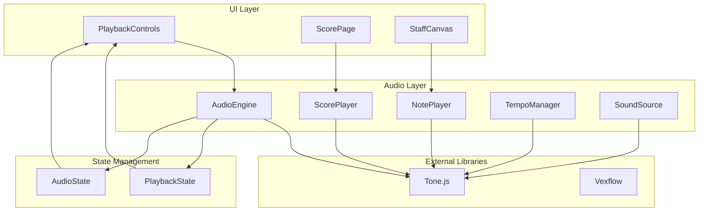

# 設計文書

## 概要

音楽エディターアプリケーションに音符再生機能を追加する。既存のReact/TypeScript + Vexflowアーキテクチャに、Tone.jsベースの音声エンジンを統合し、個別音符の再生から譜面全体の再生まで包括的な音声フィードバック機能を提供する。

## アーキテクチャ

### 全体構成



### レイヤー分離

1. **UI Layer**: ユーザーインターフェース（React コンポーネント）
2. **Audio Layer**: 音声処理ロジック（Tone.js ラッパー）
3. **State Management**: 再生状態とオーディオ状態の管理
4. **External Libraries**: 外部ライブラリ（Tone.js, Vexflow）

## コンポーネントとインターフェース

### AudioEngine

音声エンジンの中核となるクラス。Web Audio APIとTone.jsの初期化・管理を担当。

```typescript
interface AudioEngineConfig {
  sampleRate?: number;
  latencyHint?: 'interactive' | 'balanced' | 'playback';
  lookAhead?: number;
}

class AudioEngine {
  private context: Tone.Context | null = null;
  private isInitialized: boolean = false;
  // lookAhead は Tone.Transport ではなく Tone.Context に設定する
  // （Tone.js 15 の型定義に合わせる）
  
  async initialize(config?: AudioEngineConfig): Promise<void>
  async start(): Promise<void>
  async suspend(): Promise<void>
  async resume(): Promise<void>
  dispose(): void
  
  getContext(): Tone.Context | null
  isReady(): boolean
}
```

### NotePlayer

個別音符の再生を担当するクラス。

```typescript
interface NotePlaybackOptions {
  velocity?: number;
  duration?: string | number;
  time?: string | number;
}

class NotePlayer {
  private synth: Tone.PolySynth | null = null;
  private currentNotes: Set<string> = new Set();
  
  constructor(private audioEngine: AudioEngine)
  
  async playNote(
    key: string, 
    options?: NotePlaybackOptions
  ): Promise<void>
  
  stopNote(key: string): void
  stopAllNotes(): void
  
  setSoundSource(instrument: InstrumentType): void
  setVolume(volume: number): void
}
```

### ScorePlayer

譜面全体の再生を担当するクラス。

```typescript
interface PlaybackPosition {
  measureIndex: number;
  beatPosition: number;
  noteIndex: number;
}

interface ScorePlaybackOptions {
  startPosition?: PlaybackPosition;
  endPosition?: PlaybackPosition;
  loop?: boolean;
}

class ScorePlayer {
  private part: Tone.Part | null = null;
  private currentPosition: PlaybackPosition = { measureIndex: 0, beatPosition: 0, noteIndex: 0 };
  private isPlaying: boolean = false;
  
  constructor(
    private audioEngine: AudioEngine,
    private tempoManager: TempoManager
  )
  
  loadScore(measures: MeasureData[]): void
  
  async play(options?: ScorePlaybackOptions): Promise<void>
  pause(): void
  stop(): void
  
  seekTo(position: PlaybackPosition): void
  getCurrentPosition(): PlaybackPosition
  
  onPositionChange(callback: (position: PlaybackPosition) => void): void
  onPlaybackComplete(callback: () => void): void
}
```

### TempoManager

テンポ設定と管理を行うクラス。

```typescript
interface TempoSettings {
  bpm: number;
  timeSignature: [number, number]; // [numerator, denominator]
}

class TempoManager {
  private settings: TempoSettings = { bpm: 120, timeSignature: [4, 4] };
  private listeners: Set<(settings: TempoSettings) => void> = new Set();
  
  setBPM(bpm: number): void
  getBPM(): number
  
  setTimeSignature(numerator: number, denominator: number): void
  getTimeSignature(): [number, number]
  
  getSettings(): TempoSettings
  
  onChange(callback: (settings: TempoSettings) => void): void
  removeListener(callback: (settings: TempoSettings) => void): void
}
```

### SoundSource

音色管理を行うクラス。

```typescript
enum InstrumentType {
  PIANO = 'piano',
  ORGAN = 'organ',
  GUITAR = 'guitar',
  STRINGS = 'strings',
  BRASS = 'brass',
  WOODWIND = 'woodwind'
}

interface InstrumentConfig {
  type: InstrumentType;
  volume: number;
  effects?: EffectConfig[];
}

class SoundSource {
  private currentInstrument: InstrumentType = InstrumentType.PIANO;
  private synthMap: Map<InstrumentType, Tone.PolySynth> = new Map();
  
  constructor(private audioEngine: AudioEngine)
  
  async loadInstrument(type: InstrumentType): Promise<void>
  setCurrentInstrument(type: InstrumentType): void
  getCurrentInstrument(): InstrumentType
  
  getSynth(type?: InstrumentType): Tone.PolySynth | null
  
  getAvailableInstruments(): InstrumentType[]
  preloadInstruments(types: InstrumentType[]): Promise<void>
}
```

### PlaybackControls

再生制御UIコンポーネント。

```typescript
interface PlaybackControlsProps {
  playbackState: PlaybackState;
  currentPosition: PlaybackPosition;
  onPlay: () => void;
  onPause: () => void;
  onStop: () => void;
  onSeek: (position: PlaybackPosition) => void;
}

const PlaybackControls: React.FC<PlaybackControlsProps> = ({
  playbackState,
  currentPosition,
  onPlay,
  onPause,
  onStop,
  onSeek
}) => {
  // 再生/一時停止/停止ボタン
  // 再生位置表示
  // シークバー
  // テンポ設定
  // 音色選択
}
```

## データモデル

### 再生状態

```typescript
enum PlaybackState {
  STOPPED = 'stopped',
  PLAYING = 'playing',
  PAUSED = 'paused',
  LOADING = 'loading',
  ERROR = 'error'
}

interface AudioState {
  isInitialized: boolean;
  currentInstrument: InstrumentType;
  volume: number;
  tempo: TempoSettings;
  error?: AudioError;
}

interface AudioError {
  type: 'initialization' | 'playback' | 'loading' | 'permission';
  message: string;
  recoverable: boolean;
}
```

### 音符データ拡張

既存の`NoteEvent`インターフェースを拡張して再生情報を追加。

```typescript
// 既存のNoteEventを拡張
interface PlayableNoteEvent extends NoteEvent {
  // 既存: dur, isRest, key
  velocity?: number; // 0-127, デフォルト64
  startTime?: number; // 小節内での開始時間（拍単位）
}

// 再生用の内部データ構造
interface ScheduledNote {
  note: string; // Tone.js形式 (例: "C4", "F#3")
  velocity: number; // 0-1の範囲に正規化
  duration: number; // 秒単位
  time: number; // 絶対時間（秒）
  measureIndex: number;
  noteIndex: number;
}
```

## 正確性プロパティ

*プロパティとは、システムのすべての有効な実行において真であるべき特性や動作のことです。これらは人間が読める仕様と機械で検証可能な正確性保証の橋渡しとなります。*

### プロパティ1: 個別音符再生の正確性

*任意の* 有効な音符データ（臨時記号を含む）に対して、NotePlayerで再生される音高は元の音符データのキーと正確に一致する必要がある

**検証対象: 要件1.1, 1.3**

### プロパティ2: 休符の無音保証

*任意の* 休符データに対して、NotePlayerは音を再生せず、指定された音価分の無音時間を保持する必要がある

**検証対象: 要件1.2, 2.3**

### プロパティ3: 音価の時間正確性

*任意の* 音符の音価に対して、実際の再生時間は指定された音価に対応する時間と許容誤差内で一致する必要がある

**検証対象: 要件1.4**

### プロパティ4: 連続再生の排他制御

*任意の* 連続する音符再生操作に対して、前の音符は停止され、新しい音符のみが再生される必要がある

**検証対象: 要件1.5**

### プロパティ5: 譜面再生の順序保証

*任意の* 譜面データに対して、ScorePlayerは音符を時間順序通りに再生し、小節境界を正確なタイミングで越える必要がある

**検証対象: 要件2.1, 2.2**

### プロパティ6: 同時音符の並行再生

*任意の* 同時刻に配置された複数音符に対して、ScorePlayerはそれらを同時に再生する必要がある

**検証対象: 要件2.5**

### プロパティ7: 再生制御の状態一貫性

*任意の* 再生制御操作（開始/停止/一時停止/再開）に対して、PlaybackStateは操作に対応する正しい状態に遷移し、Time_Positionを適切に管理する必要がある

**検証対象: 要件3.1, 3.2, 3.3, 3.4**

### プロパティ8: テンポ設定の範囲検証と即座反映

*任意の* テンポ値に対して、有効範囲（60-200 BPM）内の値は受け入れられ、再生中の変更は次の音符から即座に適用される必要がある

**検証対象: 要件4.2, 4.4**

### プロパティ9: 音色変更の一貫性

*任意の* 音色変更に対して、その後のすべての音符再生（個別・譜面両方）は新しい音色で行われる必要がある

**検証対象: 要件5.3, 5.4**

### プロパティ10: 設定の永続化ラウンドトリップ

*任意の* テンポ・音色設定に対して、保存後の復元により同じ設定値が得られる必要がある

**検証対象: 要件4.5, 5.5**

### プロパティ11: 再生位置ハイライトの同期

*任意の* 再生位置変更に対して、視覚的ハイライトは現在の再生位置と正確に同期し、停止時にはすべて解除される必要がある

**検証対象: 要件7.2, 7.3, 7.4**

### プロパティ12: メモリ使用量の制限

*任意の* 長い譜面再生に対して、メモリ使用量は事前定義された上限を超えない必要がある

**検証対象: 要件9.1**

### プロパティ13: リソース解放の完全性

*任意の* 音声リソース使用後に、停止・dispose操作によってすべてのリソースが適切に解放される必要がある

**検証対象: 要件9.3**

## エラーハンドリング

### エラー分類

1. **初期化エラー**: Web Audio API利用不可、権限拒否
2. **再生エラー**: 音声データ読み込み失敗、メモリ不足
3. **ネットワークエラー**: 音色データ取得失敗
4. **ユーザーエラー**: 無効なテンポ値、範囲外パラメータ

### エラー処理戦略

```typescript
class AudioErrorHandler {
  static handle(error: AudioError): AudioErrorRecovery {
    switch (error.type) {
      case 'initialization':
        return {
          action: 'retry',
          fallback: 'showUserPrompt',
          message: 'オーディオの初期化に失敗しました。ページを再読み込みしてください。'
        };
      
      case 'playback':
        return {
          action: 'fallback',
          fallback: 'useDefaultInstrument',
          message: '音色の読み込みに失敗しました。デフォルト音色を使用します。'
        };
      
      case 'permission':
        return {
          action: 'prompt',
          fallback: 'disableAudio',
          message: 'オーディオの再生にはユーザー操作が必要です。'
        };
      
      default:
        return {
          action: 'log',
          fallback: 'continue',
          message: '予期しないエラーが発生しました。'
        };
    }
  }
}
```

## テスト戦略

### 二重テストアプローチ

**ユニットテスト**: 特定の例、エッジケース、エラー条件を検証
**プロパティテスト**: すべての入力にわたる普遍的プロパティを検証

両方のテストは相補的で包括的なカバレッジに必要です。

### ユニットテストの焦点

- 特定の音符データでの再生動作例
- コンポーネント間の統合ポイント
- エラー条件とエッジケース（無効な音高、範囲外テンポ）
- ブラウザ固有の動作（自動再生ポリシー）

### プロパティテストの焦点

- ランダム化による包括的入力カバレッジ
- 普遍的プロパティの検証
- 最小100回の反復実行
- 各テストは設計文書のプロパティを参照

### プロパティベーステスト設定

- **ライブラリ**: fast-check（既存依存関係）
- **反復回数**: 最小100回
- **タグ形式**: **Feature: note-playback, Property {number}: {property_text}**
- 各正確性プロパティは単一のプロパティベーステストで実装

### テスト例

```typescript
// ユニットテスト例
describe('NotePlayer', () => {
  it('should play C4 note correctly', async () => {
    const notePlayer = new NotePlayer(mockAudioEngine);
    await notePlayer.playNote('C4', { duration: '4n' });
    expect(mockSynth.triggerAttackRelease).toHaveBeenCalledWith('C4', '4n', expect.any(Number), expect.any(Number));
  });
});

// プロパティテスト例
describe('Property Tests', () => {
  it('Property 1: Individual note playback accuracy', () => {
    // Feature: note-playback, Property 1: 任意の有効な音符データに対して、NotePlayerで再生される音高は元の音符データのキーと一致する必要がある
    fc.assert(fc.property(
      fc.record({
        key: fc.oneof(fc.constant('C4'), fc.constant('D4'), fc.constant('E4')),
        dur: fc.oneof(fc.constant('1'), fc.constant('2'), fc.constant('4')),
        isRest: fc.constant(false)
      }),
      async (noteEvent) => {
        const notePlayer = new NotePlayer(mockAudioEngine);
        await notePlayer.playNote(noteEvent.key);
        expect(mockSynth.triggerAttackRelease).toHaveBeenCalledWith(
          noteEvent.key, 
          expect.any(String), 
          expect.any(Number), 
          expect.any(Number)
        );
      }
    ), { numRuns: 100 });
  });
});
```