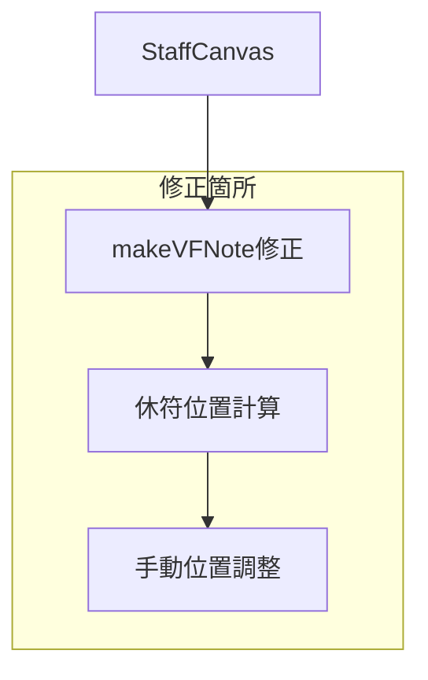

# 設計書

## 概要

五線譜エディタにおける休符重なり問題を解決するため、Vexflowの`setCenterAlignment`を無効化し、時間ベースの位置計算を実装する。シンプルで直接的なアプローチにより、最小限の変更で問題を解決する。

## 問題の根本原因

1. **Vexflowの`setCenterAlignment(true)`**: 休符を中央に配置しようとする
2. **同じ時間位置の複数休符**: Formatterが区別して配置できない
3. **視覚的重なり**: 複数の休符が同じX座標に描画される

## 解決アプローチ

### シンプルな3段階修正

1. **休符の中央揃えを無効化**: `setCenterAlignment`を削除
2. **時間ベース位置計算**: 休符を時間軸に沿って配置
3. **手動位置調整**: Formatter後に休符位置を微調整

### システム構成（シンプル化）



### データフロー（シンプル化）

1. **休符作成**: `setCenterAlignment`を無効化
2. **Formatter実行**: Vexflowの標準配置
3. **位置調整**: 休符のX座標を時間ベースで再計算
4. **描画**: 調整された位置で描画

## コンポーネントとインターフェース

### 1. makeVFNote関数の修正

休符作成時の中央揃えを無効化する。

```typescript
function makeVFNote(ev: NoteEvent) {
  const vfDur = toVFDur(ev.dur);
  if (ev.isRest) {
    const n = new StaveNote({ clef: 'treble', keys: ['b/4'], duration: (vfDur as VFDur) + 'r' });
    // setCenterAlignment(true)を削除 - 中央揃えを無効化
    return n;
  }
  // 音符の処理は変更なし
  const n = new StaveNote({ clef: 'treble', keys: [ev.key], duration: vfDur });
  const m = ev.key.match(/^([a-g])([#b]?)[/ ]([0-9]+)$/i);
  const acc = m?.[2] || '';
  if (acc) {
    try { 
      (n as any).addModifier?.(0, new Accidental(acc)); 
      (n as any).addAccidental?.(0, new Accidental(acc)); 
    } catch {}
  }
  return n;
}
```

### 2. 時間ベース位置計算

各休符の時間位置に基づいてX座標を計算する。

```typescript
/**
 * 時間位置をX座標に変換する
 * @param timePosition 拍単位での時間位置
 * @param measureWidth 小節の幅
 * @param measureLeft 小節の左端X座標
 * @returns X座標
 */
function calculateTimeBasedX(
  timePosition: number, 
  measureWidth: number, 
  measureLeft: number
): number {
  // 4拍を小節幅に比例配分
  const ratio = timePosition / BEATS_PER_MEASURE;
  return measureLeft + (measureWidth * ratio);
}
```

### 3. 休符位置調整

Formatter実行後に休符の位置を手動調整する。

```typescript
/**
 * 休符の位置を時間ベースで調整する
 * @param vfNotes VexflowのStaveNoteリスト
 * @param events 元の音符・休符データ
 * @param measureLeft 小節の左端X座標
 * @param measureWidth 小節の幅
 */
function adjustRestPositions(
  vfNotes: StaveNote[], 
  events: NoteEvent[], 
  measureLeft: number, 
  measureWidth: number
): void {
  let currentTime = 0;
  
  for (let i = 0; i < vfNotes.length && i < events.length; i++) {
    const note = vfNotes[i];
    const event = events[i];
    
    if (event.isRest) {
      // 時間ベースのX座標を計算
      const targetX = calculateTimeBasedX(currentTime, measureWidth, measureLeft);
      
      // 現在の位置との差分を計算
      const currentX = (note as any).getAbsoluteX?.() || 0;
      const offset = targetX - currentX;
      
      // 位置を調整
      if (Math.abs(offset) > 1) { // 1px以上の差がある場合のみ調整
        (note as any).setXShift?.(offset);
      }
    }
    
    // 次の時間位置を計算
    const duration = toVFDur(event.dur);
    currentTime += beatsFromVF(duration);
  }
}
```

## データモデル（シンプル化）

### 既存のNoteEvent（変更なし）

```typescript
type NoteEvent = { 
  dur: DurKey; 
  isRest: boolean; 
  key: string 
};
```

### 時間位置情報

```typescript
type TimePosition = {
  startTime: number;  // 拍単位での開始時間
  duration: number;   // 拍単位での長さ
};
```

## 正確性プロパティ（シンプル化）

*プロパティとは、システムのすべての有効な実行において真であるべき特性や動作のことです。*

### プロパティ1: 休符重なり防止
*任意の*小節において、複数の休符は視覚的に重ならない位置に配置されるべきである
**検証対象: 要件 1.1, 1.2**

### プロパティ2: 時間軸順序保持
*任意の*小節内の要素について、時間的に早い要素は水平位置でもより左側に配置されるべきである
**検証対象: 要件 1.3, 2.1, 2.2**

## エラーハンドリング（シンプル化）

### 位置計算エラー

- **無効な時間位置**: 負の値や範囲外の時間位置の処理
- **座標計算失敗**: 数値エラーや無限値の処理

### 描画エラー

- **Vexflowエラー**: setXShiftやgetAbsoluteXの失敗処理
- **座標範囲外**: 描画領域外への配置の処理

## テスト戦略（シンプル化）

### 単体テスト

**対象**:
- makeVFNote関数の修正（setCenterAlignment無効化）
- calculateTimeBasedX関数の時間-座標変換
- adjustRestPositions関数の位置調整

**テストケース**:
- 単一休符の配置
- 複数休符の時間順配置
- 音符と休符の混在配置
- エラー条件の処理

### プロパティベーステスト

**設定**:
- **テストライブラリ**: fast-check
- **反復回数**: 各プロパティテストで最低100回
- **タグ形式**: **Feature: rest-overlap-fix, Property {番号}: {プロパティテキスト}**

**対象プロパティ**:
1. 休符重なり防止の普遍性
2. 時間軸順序の一貫性