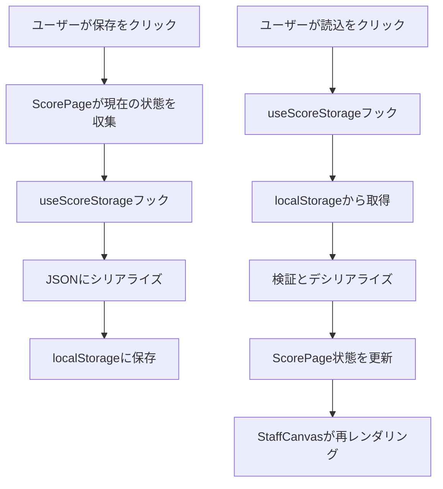

# 設計書: 譜面保存・読込機能

## 概要

この設計は、localStorageを永続化レイヤーとして使用して、音楽譜面アプリケーションの保存・読込機能を実装します。複雑な音楽譜面データのシリアライゼーションとデシリアライゼーションに対して、堅牢で型安全なアプローチを提供し、既存機能との後方互換性を維持します。

この設計は、localStorage操作用のカスタムフック、容量制限に対する包括的なエラーハンドリング、既存コンポーネントアーキテクチャとのシームレスな統合を実装することで、Reactのベストプラクティスに従っています。

## アーキテクチャ

### コンポーネント統合

保存・読込機能は以下を通じて既存アーキテクチャに統合されます：

1. **ScorePage.tsx**: 保存・読込UIボタンをホストし、全体的な譜面状態を管理
2. **StaffCanvas.tsx**: 譜面データアクセスと状態管理統合を提供
3. **カスタムフック**: `useScoreStorage`が型安全性を持つすべてのlocalStorage操作を処理
4. **ストレージサービス**: データのシリアライゼーション、検証、エラーハンドリング用のユーティリティ関数

### データフロー



## コンポーネントとインターフェース

### データモデル

```typescript
interface ScoreMetadata {
  title: string;
  subtitle: string;
  lyricist: string;
  composer: string;
  arranger: string;
}

interface NoteEvent {
  dur: '1' | '2' | '4' | '8' | '16' | '32' | '64';
  isRest: boolean;
  key: string;
}

interface MeasureData {
  events: NoteEvent[];
}

interface SavedScoreData {
  version: string;
  timestamp: number;
  metadata: ScoreMetadata;
  measures: MeasureData[];
  systems: number;
  measuresPerSystem: number;
}
```

### ストレージフックインターフェース

```typescript
interface UseScoreStorageReturn {
  saveScore: (data: SavedScoreData) => Promise<boolean>;
  loadScore: () => Promise<SavedScoreData | null>;
  hasStoredData: () => boolean;
  clearStoredData: () => void;
  error: string | null;
  isLoading: boolean;
}

function useScoreStorage(): UseScoreStorageReturn;
```

### UIコンポーネント

```typescript
interface SaveLoadButtonsProps {
  onSave: () => void;
  onLoad: () => void;
  isSaving: boolean;
  isLoading: boolean;
  hasStoredData: boolean;
}

function SaveLoadButtons(props: SaveLoadButtonsProps): JSX.Element;
```

## データモデル

### ストレージスキーマ

保存される譜面データは、将来のマイグレーションを可能にするバージョン管理されたスキーマに従います：

```json
{
  "version": "1.0.0",
  "timestamp": 1704067200000,
  "metadata": {
    "title": "タイトル",
    "subtitle": "サブタイトル",
    "lyricist": "作詞者",
    "composer": "作曲者",
    "arranger": "編曲者"
  },
  "measures": [
    {
      "events": [
        {
          "dur": "4",
          "isRest": false,
          "key": "c/4"
        }
      ]
    }
  ],
  "systems": 6,
  "measuresPerSystem": 4
}
```

### ストレージキー戦略

- **プライマリキー**: `music-score-app-data`
- **バックアップキー**: `music-score-app-backup` (復旧シナリオ用)
- **メタデータキー**: `music-score-app-meta` (保存タイムスタンプとバージョン情報を保存)

## 正確性プロパティ

*プロパティとは、システムのすべての有効な実行において真であるべき特性や動作のことです。本質的に、システムが何をすべきかについての形式的な記述です。プロパティは、人間が読める仕様と機械で検証可能な正確性保証の橋渡しをします。*

### プロパティ反映

すべての受け入れ条件を分析した結果、統合可能な冗長なプロパティをいくつか特定しました：

- データ保存完全性に関するプロパティ（1.3、1.4）は、1つの包括的な保存完全性プロパティに統合可能
- データ読込復元に関するプロパティ（2.2、2.3）は、1つの包括的な読込復元プロパティに統合可能
- 複数のラウンドトリッププロパティ（5.1、5.2、5.3、5.4）は、1つの包括的なラウンドトリッププロパティに統合可能
- 後方互換性プロパティ（6.1、6.2、6.4、6.5）は、1つの包括的な互換性プロパティに統合可能

### コアプロパティ

**プロパティ1: JSONシリアライゼーション有効性**
*任意の*有効な譜面データに対して、JSONにシリアライズすると元のデータをすべて含む有効なJSONが生成される
**検証対象: 要件 1.1**

**プロパティ2: ストレージキー一貫性**
*任意の*保存操作に対して、データは一貫したキー「music-score-app-data」を使用してlocalStorageに保存される
**検証対象: 要件 1.2、4.4**

**プロパティ3: 保存データ完全性**
*任意の*小節、音符、メタデータを持つ譜面に対して、保存時にすべての小節データ、音符イベント、メタデータフィールドが保存されたJSONに保持される
**検証対象: 要件 1.3、1.4**

**プロパティ4: エラーハンドリング耐性**
*任意の*localStorageエラー状況（容量超過、ストレージ無効、データ破損）に対して、システムはクラッシュすることなく適切にエラーを処理する
**検証対象: 要件 1.5、2.6、4.5**

**プロパティ5: 読込データ取得**
*任意の*localStorageに保存された譜面データに対して、読込操作は保存されたものと全く同じJSONデータを取得する
**検証対象: 要件 2.1**

**プロパティ6: 読込データ復元**
*任意の*有効な保存データに対して、読込時にすべての小節データとメタデータが正しくデシリアライズされ、アプリケーション状態に復元される
**検証対象: 要件 2.2、2.3、2.4**

**プロパティ7: 保存-読込ラウンドトリップ**
*任意の*完全な譜面（小節、音符、メタデータを含む）に対して、保存してから読込すると、すべてのデータが正確に保持された同等の譜面が生成される
**検証対象: 要件 5.1、5.2、5.3、5.4**

**プロパティ8: ストレージ永続性**
*任意の*保存された譜面データに対して、明示的にクリアされるまで複数の操作を通じてlocalStorageでアクセス可能である
**検証対象: 要件 4.1**

**プロパティ9: データ検証**
*任意の*保存または読込操作に対して、システムはデータ整合性を検証し、無効なデータを拒否または修正する
**検証対象: 要件 5.5**

**プロパティ10: 後方互換性**
*任意の*既存機能（音符配置、キーボードショートカット、ツール使用）に対して、保存・読込機能の追加は既存の動作を妨害または破壊しない
**検証対象: 要件 6.1、6.2、6.4、6.5**

**プロパティ11: UIローディング状態**
*任意の*保存または読込操作に対して、UIは操作中に適切なローディング状態を表示する
**検証対象: 要件 3.4**

## エラーハンドリング

### localStorageエラーシナリオ

1. **容量超過**: localStorageが満杯の場合、操作をtry-catchブロックで囲み、ユーザーフィードバックを提供
2. **ストレージ無効**: localStorageが無効な場合（プライベートブラウジングモード）を処理
3. **データ破損**: JSON構造を検証し、空の状態へのフォールバックを提供
4. **ネットワーク問題**: localStorageアクセスが失敗する場合を処理

### エラー復旧戦略

```typescript
enum StorageErrorType {
  QUOTA_EXCEEDED = 'quota_exceeded',
  STORAGE_DISABLED = 'storage_disabled',
  CORRUPTED_DATA = 'corrupted_data',
  UNKNOWN_ERROR = 'unknown_error'
}

interface StorageError {
  type: StorageErrorType;
  message: string;
  recoverable: boolean;
}
```

## 追補: 新規譜面作成

### 問題

保存・読込 UI には、現在の編集内容を破棄して空の譜面から始める入口がなかった。保存済みスロットが残ったままだと、読込操作で古い譜面へ戻ってしまい、新規作成として期待される状態にならない。

### 修正設計

- `SaveLoadButtons` は `onNewScore` が渡されたときだけ「新規作成」ボタンを表示する。
- `ScorePage` は確認ダイアログ後に `clearStoredData()` を呼び、主データ・バックアップ・メタデータをまとめて消す。
- 画面状態は空の単旋律譜へ戻す。メタ情報、楽譜種別、編成、調号、拍子、パートデータ、選択範囲、コピー内容、Undo/Redo、再生状態を同時に初期化する。
- ファイル保存ハンドルも破棄し、新規譜面の保存時に以前のファイルを意図せず上書きしない。
- 譜面描画コンポーネントは、親から渡された空配列を「空譜へのリセット指示」として同期する。空配列を無視すると、内部 state に残った古い音符が表示され続けるため。

### 影響範囲

- LocalStorage の保存スロットを明示的に消去するため、ユーザー確認を必ず挟む。
- 既存の保存・読込・ファイル保存・ファイル読込のデータ形式は変更しない。

### ユーザーフィードバック

- **保存エラー**: 具体的なエラーメッセージと推奨アクションを含むトースト通知を表示
- **読込エラー**: エラー詳細と空の譜面で開始するオプションを含むモーダルを表示
- **容量問題**: 古いデータのクリアまたはエクスポート機能の使用を提案

## テスト戦略

### 二重テストアプローチ

テスト戦略は、包括的なカバレッジを確保するために単体テストとプロパティベーステストの両方を採用します：

**単体テスト**: 特定の例、エッジケース、エラー条件に焦点
- 既知のデータを使用した特定の保存・読込シナリオをテスト
- シミュレートされたlocalStorage障害でのエラーハンドリングをテスト
- UIコンポーネントのレンダリングと相互作用をテスト
- コンポーネント間の統合をテスト

**プロパティベーステスト**: すべての入力にわたる普遍的プロパティを検証
- ランダムな譜面データを生成し、ラウンドトリップ一貫性を検証
- 様々なデータ構造でのシリアライゼーション/デシリアライゼーションをテスト
- 異なる障害シナリオでのエラーハンドリングを検証
- 既存機能との後方互換性をテスト

### プロパティベーステスト設定

- **テストライブラリ**: TypeScriptプロパティベーステスト用に`fast-check`を使用
- **テスト反復**: プロパティテストあたり最低100回の反復
- **テストタグ付け**: 各プロパティテストは設計書のプロパティを参照
- **タグ形式**: `Feature: score-save-load, Property {number}: {property_text}`

### テストデータ生成

```typescript
// プロパティベーステスト用のジェネレータ例
const noteEventArbitrary = fc.record({
  dur: fc.constantFrom('1', '2', '4', '8', '16', '32', '64'),
  isRest: fc.boolean(),
  key: fc.string({ minLength: 3, maxLength: 5 })
});

const measureDataArbitrary = fc.record({
  events: fc.array(noteEventArbitrary, { maxLength: 10 })
});

const scoreMetadataArbitrary = fc.record({
  title: fc.string({ maxLength: 100 }),
  subtitle: fc.string({ maxLength: 100 }),
  lyricist: fc.string({ maxLength: 50 }),
  composer: fc.string({ maxLength: 50 }),
  arranger: fc.string({ maxLength: 50 })
});
```

### 統合テスト

- 実際のlocalStorageを使用した完全な保存・読込ワークフローをテスト
- 読み込まれたデータがUIに正しく反映されることを検証
- モックされたlocalStorage障害でのエラーシナリオをテスト
- 既存の譜面編集機能との後方互換性を検証

<function_calls>
<invoke name="prework">
<parameter name="featureName">score-save-load
